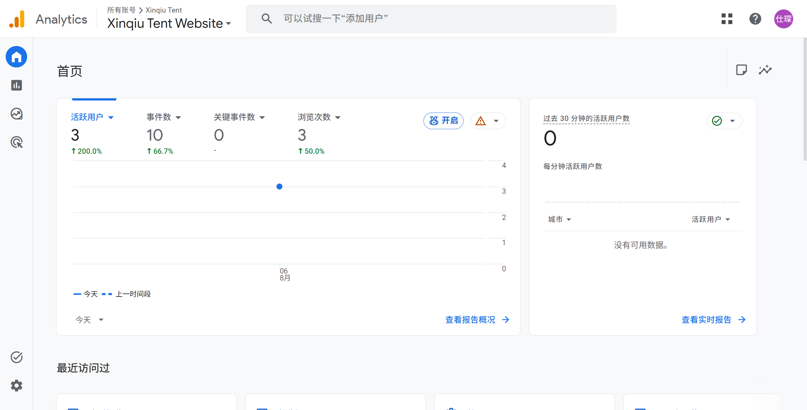
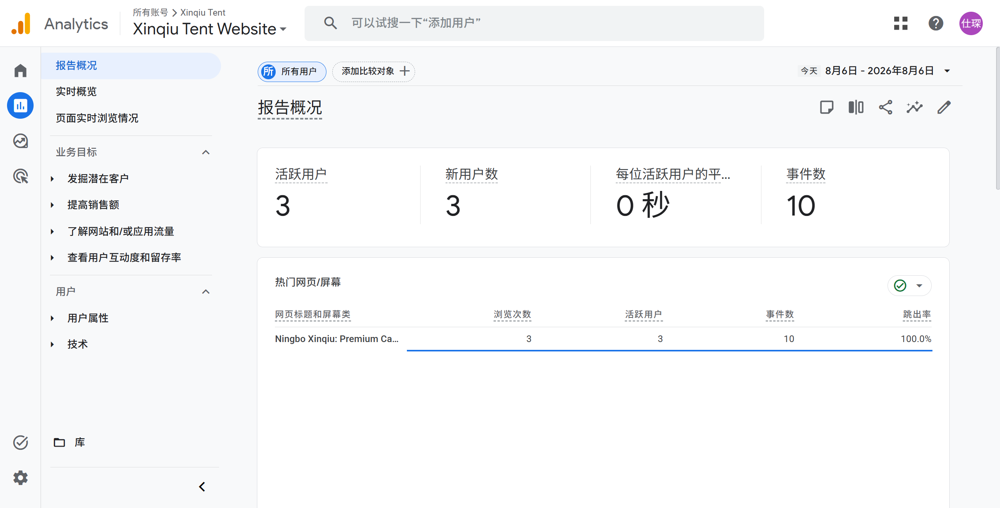
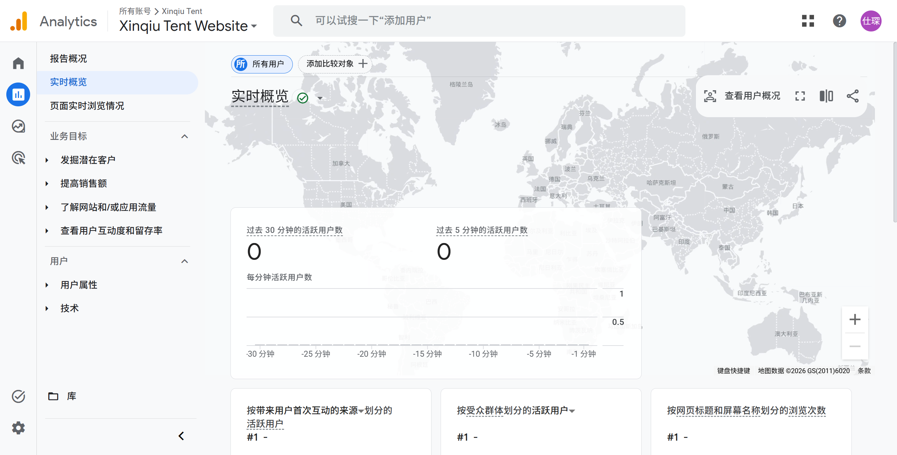

# 🌐 xinqiutent.com 独立站流量分析报告

**报告日期：** 2026年8月6日（周四）  
**数据截止时间：** 20:00（北京时间）  
**报告时间：** 22:45（北京时间）  
**数据来源：** Google Analytics 4（媒体资源：xinqiutent.com, Property ID: p533728209）  
**⚠️ 声明：** 本报告仅包含独立站 xinqiutent.com 数据，不含任何国际站（Alibaba.com）数据。

---

## 一、今日核心指标总览

| 指标 | 数值 | 环比变化 |
|------|------|----------|
| 🧑 **活跃用户数** | **3** | ↑ 200.0% |
| 🆕 **新用户数** | **3** | — |
| 👀 **页面浏览量** | **3** | ↑ 50.0% |
| 📊 **事件数** | **10** | ↑ 66.7% |
| ⭐ **关键事件数** | **0** | — |
| ⏱️ **平均互动时长** | **0 秒** | — |
| 💔 **跳出率** | **100%** | — |

---

## 二、热门页面排行

| 排名 | 页面标题 | 浏览量 | 活跃用户 | 事件数 | 跳出率 |
|------|----------|--------|----------|--------|--------|
| 1 | Ningbo Xinqiu: Premium Camping Tent Factory - Professional OEM/ODM Manufacturing | 3 | 3 | 10 | 100% |

> 📌 **分析：** 今日仅 1 个页面有访问记录，为英文首页。跳出率 100%，互动时长为 0 秒，说明访客进入后无任何后续交互行为。

---

## 三、流量来源分析

### 3.1 首次用户来源（今日）

| 来源/媒介 | 活跃用户 |
|-----------|----------|
| (direct) / (none) | 2 |
| (data not available) | 1 |

### 3.2 会话来源（今日）

| 来源/媒介 | 会话数 |
|-----------|--------|
| (direct) / (none) | 2 |
| (data not available) | 1 |

> 📌 **分析：** 今日 3 位用户中，2 位通过直接访问进入，1 位来源未知（可能是隐私浏览或 referrer 被屏蔽）。无搜索引擎流量、无社交流量、无引荐流量。流量几乎全部来自直接访问。

---

## 四、热门国家/地区（今日）

| 排名 | 国家/地区 | 活跃用户 |
|------|-----------|----------|
| 1 | 🇺🇸 United States | 2 |
| 2 | 🇵🇰 Pakistan | 1 |
| 3 | 🇬🇧 United Kingdom | 0（对比基准） |

### 城市分布（今日）

| 城市 | 活跃用户 |
|------|----------|
| Karachi（巴基斯坦） | 1 |
| Washington（美国） | 1 |

> 📌 **分析：** 今日访客来自美国和巴基斯坦。与过去 7 天数据一致——美国始终是第一大流量来源国。无中国本土流量（独立站面向海外市场，属正常现象）。

---

## 五、实时流量监控

| 指标 | 数值 |
|------|------|
| 🔴 过去 30 分钟活跃用户 | **0** |
| 🔴 过去 5 分钟活跃用户 | **0** |

> 📌 **实时报告所有维度均显示"没有可用数据"**，包括：实时来源、实时受众、实时页面、实时事件。地图上无任何活跃标记。**当前无任何在线买家。**

---

## 六、近 28 天趋势参考（2026.7.9 - 2026.8.5）

### 6.1 总体指标

| 指标 | 数值 |
|------|------|
| 活跃用户 | 106 |
| 新用户 | 101 |
| 事件数 | 574 |
| 平均互动时长 | 5 分 09 秒 |

### 6.2 TOP 10 国家/地区

| 排名 | 国家 | 活跃用户 | 占比 |
|------|------|----------|------|
| 1 | 🇺🇸 United States | 38 | 35.85% |
| 2 | 🇨🇳 China | 12 | 11.32% |
| 3 | 🇩🇪 Germany | 8 | 7.55% |
| 4 | 🇳🇱 Netherlands | 5 | 4.72% |
| 5 | 🇨🇦 Canada | 4 | 3.77% |
| 6 | 🇯🇵 Japan | 4 | 3.77% |
| 7 | 🇬🇧 United Kingdom | 4 | 3.77% |
| 8 | 🇦🇺 Australia | 3 | 2.83% |
| 9 | 🇧🇷 Brazil | 3 | 2.83% |
| 10 | 🇫🇷 France | 3 | 2.83% |

### 6.3 TOP 会话来源

| 来源/媒介 | 会话数 | 占比 |
|-----------|--------|------|
| (direct) / (none) | 97 | 主要 |
| google / organic | 14 | — |
| chatgpt.com / ai-assistant | 4 | — |
| bing / organic | 2 | — |
| v5zhui.realurl07.cc / referral | 2 | — |
| cn.bing.com / referral | 1 | — |
| facebook.com / referral | 1 | — |

---

## 七、综合评估与建议

### 🔴 现状评估
- **流量极低：** 今日仅 3 位活跃用户，远低于近 28 天日均约 3.8 人/天。
- **零转化：** 关键事件数持续为 0，无任何询盘或购买转化。
- **零互动：** 跳出率 100%，平均互动时长 0 秒，访客几乎"秒进秒出"。
- **SEO 薄弱：** Google 自然搜索过去 28 天仅贡献 14 个会话，占比不到 10%。
- **付费广告缺失：** 无任何 Google Ads 或社交媒体广告流量。

### 🟡 建议
1. **SEO 优化：** 当前 Google organic 流量极少，建议优化产品页面关键词（camping tent, OEM tent factory, glamping tent 等）。
2. **内容营销：** ChatGPT 已有少量 AI 引导流量，可加强 AI 可发现的品牌内容。
3. **社媒引流：** LinkedIn 和 Facebook 已有微量引荐流量，可系统化运营社媒账号。
4. **Google Ads：** GA4 提示有 ¥3000 赠金优惠，建议利用新客广告赠金测试付费搜索。
5. **页面体验：** 100% 跳出率+0 秒互动时长为危险信号，建议检查首页加载速度、移动端适配、以及首屏内容吸引力。

---

> 📎 **截图存档：**
> - 首页概览：
> - 今日报告：
> - 实时报告：

> 📊 **报告生成：** 数据来自 Google Analytics 4，由 Accio Work AI 自动采集与分析。
